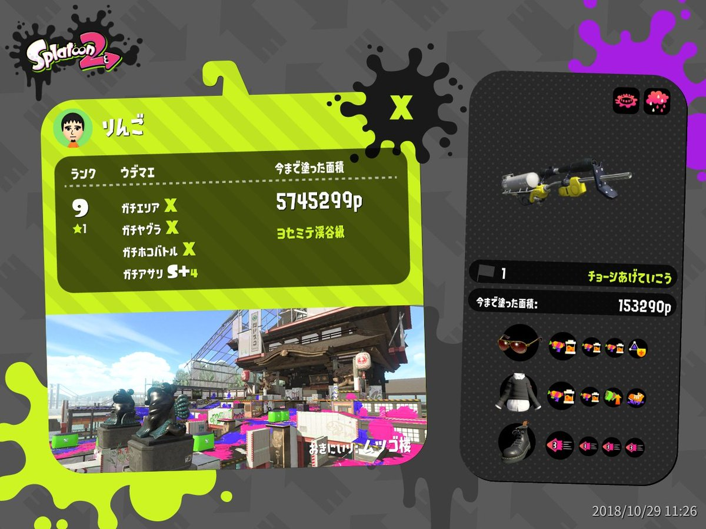
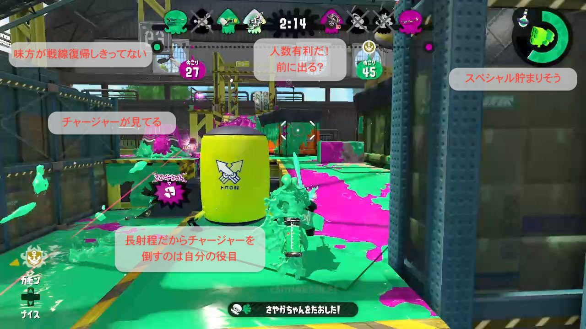

# Splatoon で考えるチーム論

🍏[@mstssk](https://twitter.com/mstssk)@[Viibar](https://viibar.com/)

スプラトゥーンはチームビルディングに良い！（暴論

----

## 注意

- 具体的なテクニックではなく、考え方の話が主です
- Splatoon での戦い方が仕事のチームにも通じるものがあるのではないか、というのが趣旨
- 少人数のチームでイカにパフォーマンスを発揮するかを考えるのに丁度よいでは？

----

という建前で、会社で Splatoon の話をします。

----

----

## 🍏のウデマエ

所詮↓の程度の人が言ってることだと思って大目に見てください

- ガチアサリはまだ S+
- 他は X だけど、なかなか上位に行けない
- しかもたまに S+9 に落ちる

>>>>

※ウデマエは20段階

- C‐, C, C+, B‐, B, B+, A‐, A, A+, S, S+(1〜9), X  
- X は修羅の国
    - ポイント制
    - 個人的には2200pあたりに越えられない壁

----

## Splatoon とは

- 4vs4 の TPS (第三者視点シューティング)
- イカをモチーフにしたキャラが墨でなくインクを撒き散らして戦うゲーム
- Wii U で発売しヒット
- その後 Nintendo Switch で [Splatoon 2](https://www.nintendo.co.jp/switch/aab6a/index.html) が発売
- 昨年の公式世界大会では日本代表が優勝

----

### ルール

- 4人がランダムにマッチングしてネット対戦
- [複数のバトルルール](https://www.nintendo.co.jp/switch/aab6a/battle/index.html)
    - レギュラーマッチ
        - ステージをインクで塗った面積を競う
    - ガチマッチ
        - プレイヤー同士の肉弾戦が多い4種類のルール
- 他のモードは割愛

今回は基本的にガチマッチで話をします。

>>>>

バトル例

<iframe width="560" height="315" src="https://www.youtube-nocookie.com/embed/_N-v7hSVtJQ?start=3015" frameborder="0" allow="accelerometer; autoplay; encrypted-media; gyroscope; picture-in-picture" allowfullscreen></iframe>

<small>
- 2018年世界大会決勝の最終ラウンド。
- 日本代表が危なげなく立ち回って完封。

</small>

----

## チームで戦うということ

- 4人で1チーム
- つまりあなたはチームの 25％
- 相性・個人技の差はあれど相手も同条件
- 勝つためには戦力比を有利に変える必要がある

>>>>

### 相性・個人技の差はあれど相手も同条件

- 同レベルの人とマッチングするので差は少ない
- 個人が 120% の力を出しても 25% → 30%
- チーム全体が揃って動くことが大きな差になる

>>>>

### 勝つためには戦力比を有利に変える必要がある

- 相手の戦力を削ぐ
    - 1人倒せば 100% vs 75%
- 生き残ることが大事
    - 戦力差を広げられないようにする
    - 味方をフォローする
    - 各個撃破されないよう味方と一緒に行動する
- 100％以上のパワーを発揮する
    - 不利でない状況（≒有利な状況）を作り続ける

----

## 自分ができることを見極める

- ブキの特性を理解する
- 味方ができることを見極める
    - 戦いの前に戦い方を考える
- 自分の戦略を決めておく
    - 行動指針を決めておくことで迷いなく動く

>>>>

### ブキの特性を理解する

- 有利なシチュエーションに持っていく
    - 持っていけない場合は逃げる
- 相性の悪い相手と戦う必要はない
    - 長射程の相手に正面からぶつかる必要はない
    - 目的はチームの勝利。敵を倒すことではない
    - 倒され不利になるより逃げて戦力比を維持
- ルール・ステージに合わせてブキを変える
    - 得意なブキと強いブキは別
    - ステージに合わせて戦い方を変えよう

>>>>

### 味方ができることを見極める

- 最初に、敵味方のブキをちゃんと見る
- 敵が何をしてくるか予想
- 味方が得意なのは何かを頭に入れておく
- 味方ができないことをやろう

>>>>

### 自分の戦略を決めておく

- 自分のブキが有利な状況をうまく活用した行動指針
    - 短射程ブキで前線をかき回し続けるとか
    - 長射程ブキで後方から嫌がらせし続けるとか
- ブキやステージによって変える
- 迷いなく動くことが大事

----

## 少ないコミュニケーションでのチームワーク

- 勝利という目標に向かってチームで動く意識
- セオリーを守ることが仲間の信頼に答えること
    - コミュニケーションができない以上、やるべきことをやるべきタイミングでしなければいけない
- 常に状況を把握する
    - 敵の動きを見る
    - 味方の動きはもっと見る

>>>>

### セオリーを守り信頼に応える

- 味方と息を合わせて動くには
- 人数有利になったら前線を上げたり自陣を塗り替えしたり
- ルールにもよるが、おおよそやるべきことは決まっている
- ほぼコミュニケーションができない状態でチームワークを発揮するにはセオリーを守ることが大事

>>>>

### 常に状況を把握する

- 味方と息を合わせるには状況把握が大事
- 敵の動きを見る
    - 突出してきたり、側背を突こうとしている敵に注意する
    - 敵が少なくなった瞬間を見極める
- 味方の動きはもっと見る
    - 気付いたら自分以外死んでたとかよくある
    - さっさと逃げて復活した味方と合流しよう
    - チームで動かないと100%以上を発揮できない

>>>>

<small>※ブキはジェットスイーパー(シューター系で最長射程)</small>

----

## 自分がするべきことを見極める

- 味方がセオリー通りに動かないかもしれない
    - チームとして戦っていることを忘れてはいけない
    - 味方と一緒に動く
    - 積極的に前線を上げて雰囲気を変えるのもアリ
- 圧倒的当事者意識
    - 味方がやらねば俺がやる
    - [「誰もガチホコを持っていないのである！」](https://www.google.co.jp/search?q=%E8%AA%B0%E3%82%82%E6%B6%88%E9%98%B2%E8%BB%8A%E3%82%92%E5%91%BC%E3%82%93%E3%81%A7%E3%81%84%E3%81%AA%E3%81%84%E3%81%AE%E3%81%A7%E3%81%82%E3%82%8B&tbm=isch)
- 時には思い切る
    - 勝利条件を達成するため時にはチャレンジする

----

## 楽しんで上を目指すこと

- アンガーマネジメント
    - 味方が止まってる？宅急便かもしれない。
- たかがゲーム。されどゲーム
    - 他人と一緒に戦っていることを忘れずに
- 阿吽の呼吸で勝利した瞬間の高揚感
    - 1人ではなしえないことを実現する
- 上手い人のプレイを見よう
    - YouTubeとかに高ランカーが動画を上げている
- PDCA を回す
    - 自己分析、仮説、反省、楽しむ

----

## まとめ

- 自分がチームのパフォーマンスを握っていることを意識すること
- 自分ができること・できないことを把握すること
- 迷いなく動けるよう行動計画を立てること
- チームのパフォーマンスが出るよう考え動くこと
- チーム内の同意を大事にし、味方の期待通りかそれ以上に動くこと
- 時には状況を変えるため積極的に動くこと
- 楽しむこと
